# XiaWorld

了不起的修仙模拟器 `Assembly-CSharp.dll` 修改教程

## 支持版本：**0.953**

文件地址：**Steam安装路径\Steam\steamapps\common\AmazingCultivationSimulator\Amazing Cultivation Simulator_Data\Managed**

## MOD下载地址

[百度网盘](https://pan.baidu.com/s/1IL1RBf-1NBABFJwNRNEaPw) 提取码: **5jv3**

## 不定期更新的帖子

* [百度贴吧](https://tieba.baidu.com/p/6034323473?pn=1)

## 目录

* [在开始之前](https://github.com/wrj2wmy/xiaworld#在开始之前)
* [快速画符相关的修改](https://github.com/wrj2wmy/xiaworld#快速画符相关的修改)
* [幽淬相关的修改](https://github.com/wrj2wmy/xiaworld#幽淬相关的修改)
* [灵淬相关的修改](https://github.com/wrj2wmy/xiaworld#灵淬相关的修改)
* [大凶房掉三种魄的修改](https://github.com/wrj2wmy/xiaworld#大凶房掉三种魄的修改)
* [历练相关的修改](https://github.com/wrj2wmy/xiaworld#历练相关的修改)
* [炼宝相关的修改](https://github.com/wrj2wmy/xiaworld#炼宝相关的修改)
* [门派人数上限的修改](https://github.com/wrj2wmy/xiaworld#门派人数上限的修改)
* [傀儡相关的修改](https://github.com/wrj2wmy/xiaworld#傀儡相关的修改)
* [自动搜索剥皮搬运的修改](https://github.com/wrj2wmy/xiaworld#自动搜索剥皮搬运的修改)
* [符咒全开](https://github.com/wrj2wmy/xiaworld#符咒全开)

## 在开始之前

明白修仙模拟器源代码的树形结构能更快的找到所需要的类。

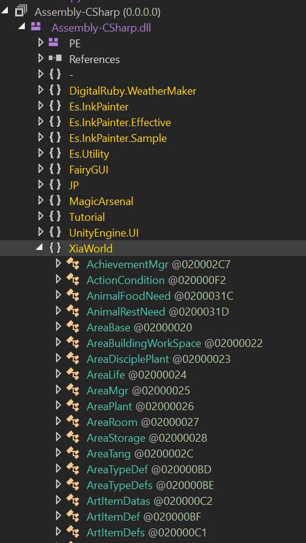

了解dnspy的搜索功能能更快的精准定位，找到所需要的代码。

快捷键 <kbd>ctrl</kbd> + <kbd>shift</kbd> + <kbd>k</kbd>

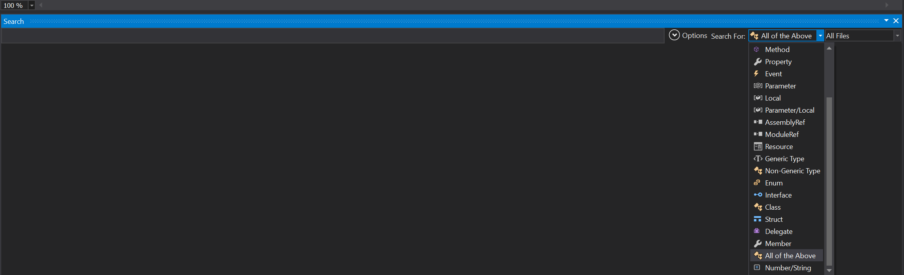


## 快速画符相关的修改

### 快速画符品质100%

**【搜索内容】**
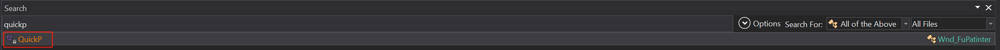

**【修改的类】** Wnd_Painter

**【原版代码】** 
```csharp

````

**【修改内容】** 
```csharp
private void QuickP()
{
	if (this.UIInfo.m_n62.grayed)
	{
		return;
	}
	if (this.CallBack != null)
	{
		this.CallBack(this.SelectName, GlobleDataMgr.Instance.GetFuValue(this.SelectName) * 1f, null, false);//把0.95f改成1f,100%继承画符品质
	}
	base.Hide();
}
````

### 跳过第一次手动画符

**【修改的类】** GlobleDataMgr

<kbd>ctrl</kbd> + <kbd>点击</kbd> 上文中的 *GetFuValue* 跳转到 GlobleDataMgr 类。

```csharp
public float GetFuValue(string name)
{
	if (this.FuSaves == null)//当没有已保存符咒信息的时候
	{
		return 1f;//把0f改成1f，让新增的符咒也能达到100%
	}
	float result = 0f;
	this.FuSaves.TryGetValue(name, out result);
	result = 1f;//添加这一行，让已保存的符咒能达到100%
	return result;
}


public void SaveFuValue(string name, float v)
{
	v = 1f;//添加这一行，强制保存的时候存入值是100%
	if (this.FuSaves == null)
	{
		this.FuSaves = new Dictionary<string, float>();
	}
	if (!this.FuSaves.ContainsKey(name))
	{
		this.FuSaves.Add(name, v);
		return;
	}
	if (v > this.FuSaves[name])
	{
		this.FuSaves[name] = v;
		this.modifier = true;
	}
}
```


## 幽淬相关的修改

**【搜索内容】**
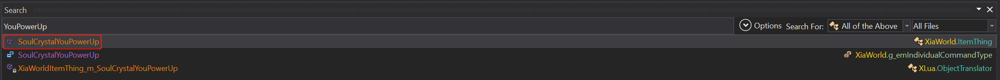

**【原版代码】** 
```csharp
public bool SoulCrystalYouPowerUp(float badd = 0f, float irate = 0f, int v = 1)
{
	if (base.Rate >= 12)
	{
		return false;
	}
	float a = Mathf.Pow(GameDefine.SOULCRYSTALYOU_BASE + badd, (float)(base.Rate + this.YouPower));//幂函数，0.9为底数，次方数=品阶+幽淬次数
	if (irate > 0f)
	{
		a = irate;
	}
	if (World.RandomRate(a))
	{
		ItemThing itemThing;
		if (base.Count == 1)
		{
			itemThing = this;
		}
		else
		{
			itemThing = this.Split(1, true);
			base.map.DropItem(itemThing, base.Key, true, true, true, false, 0f, false);
			FlyLineRender.Fly(base.Pos, itemThing.Pos, 0.2f, null, null, null, "Effect/System/FlyLine");
		}
		itemThing.YouPower += v;//幽淬次数+1
		itemThing.Rate += v;	//品阶+1
		if (itemThing.View != null && itemThing.Rate >= 3)
		{
			itemThing.View.ShowItemRay(new Color?(GameDefine.GetRateColor(itemThing.Rate)));
			itemThing.NeedClick = true;
		}
		if (itemThing.FSItemState == -1 && itemThing.Rate >= 7 && World.RandomRate(0.005f * (float)itemThing.Rate))
		{
			itemThing.FSItemState = 1;
		}
		GameWatch.Instance.PlayUIAudio("Sound/ding");
		return true;
	}
	return false;
}
````

**【修改内容】** 

<kbd>ctrl</kbd> + <kbd>点击</kbd> 原代码中的 *GameDefine.SOULCRYSTALYOU_BASE*

```csharp
public static float SOULCRYSTALYOU_BASE = 1f;//把0.9基数改成1f
```

```csharp
public bool SoulCrystalYouPowerUp(float badd = 0f, float irate = 0f, int v = 1)
{
	if (base.Rate >= 12)//当品阶大于等于12
	{
		if (this.IsFaBao)//判断是否为法宝
		{
			this.Fabao.AddGodCount(1);//天劫洗练次数加一
			if (this.View != null && base.Rate >= 3)//如果品阶大于等于3,则添加发光，玩家需要点击取消发光
			{
				this.View.ShowItemRay(new Color?(GameDefine.GetRateColor(base.Rate)));
				this.NeedClick = true;
			}
			GameWatch.Instance.PlayUIAudio("Sound/ding");//播放“叮”的一声
			return true;
		}
		return false;
	}
	else
	{
		if (World.RandomRate(Mathf.Pow(GameDefine.SOULCRYSTALYOU_BASE + badd, (float)(base.Rate + this.YouPower))))//上面改了底数，这行就不用改了
		{
			int num = Mathf.Min(10, base.Count);//判断物品本身数量和10做比较，最多循环10次。
			for (int i = 0; i < num; i++)//根据上一步算出的数量循环
			{
				ItemThing itemThing;
				if (base.Count == 1)
				{
					itemThing = this;
				}
				else
				{
					itemThing = this.Split(1, true);
					base.map.DropItem(itemThing, base.Key, true, true, true, false, 0f);
					(UnityEngine.Object.Instantiate(Resources.Load("Effect/System/FlyLine")) as GameObject).GetComponent<FlyLineRender>().Begin(base.Pos, itemThing.Pos, 0.2f, null);
				}
				itemThing.YouPower = 12 - itemThing.Rate;//计算幽淬多少次才能满12阶，次数会影响丹药效果。
				itemThing.Rate = 12;//品阶改成12阶
				if (itemThing.View != null && itemThing.Rate >= 3)
				{
					itemThing.View.ShowItemRay(new Color?(GameDefine.GetRateColor(itemThing.Rate)));
					itemThing.NeedClick = true;
				}
				if (itemThing.FSItemState == -1 && itemThing.Rate >= 7 && World.RandomRate(0.1f * (float)itemThing.Rate))//0.005改成0.1，达到100%产生镇物。
				{
					itemThing.FSItemState = 1;
				}
			}
			GameWatch.Instance.PlayUIAudio("Sound/ding");
			return true;
		}
		return false;
	}
}
````


## 灵淬相关的修改

**【搜索内容】**
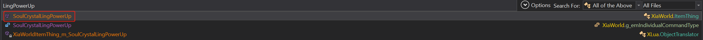

**【原版代码】**
```csharp
public bool SoulCrystalLingPowerUp(float badd = 0f)
{
	if (base.Accommodate <= 0f)
	{
		return false;
	}
	float a = Mathf.Pow(GameDefine.SOULCRYSTALLING_BASE + badd, (float)(base.Rate + this.YouPower));
	if (World.RandomRate(a))//底数0.9，越淬概率越低
	{
		ItemThing itemThing;
		if (base.Count == 1)
		{
			itemThing = this;
		}
		else
		{
			itemThing = this.Split(1, true);
			base.map.DropItem(itemThing, base.Key, true, true, true, false, 0f);
			(UnityEngine.Object.Instantiate(Resources.Load("Effect/System/FlyLine")) as GameObject).GetComponent<FlyLineRender>().Begin(base.Pos, itemThing.Pos, 0.2f, null);
		}
		itemThing.LingPower++;//灵淬次数加一
		if (itemThing.IsFaBao)//判断是否为法宝
		{
			float property = itemThing.Fabao.GetProperty(g_emFaBaoP.MaxLing);//获取现有最大灵力
			itemThing.Fabao.SetProperty(g_emFaBaoP.MaxLing, property * 1.05f);//最大灵力*1.1，每次增加最大灵力10%
		}
		else
		{
			itemThing.AccommodateAddv += 5f;
		}
		GameWatch.Instance.PlayUIAudio("Sound/ding");
		return true;
	}
	return false;
}
```

**【修改内容】** 
<kbd>ctrl</kbd> + <kbd>点击</kbd> 原代码中的 *GameDefine.SOULCRYSTALLING_BASE*

```csharp
public static float SOULCRYSTALLING_BASE = 1f;//把0.9基数改成1f
```


```csharp
public bool SoulCrystalLingPowerUp(float badd = 0f)
{
	if (base.Accommodate <= 0f && !this.IsFaBao)//加上条件跳过法宝
	{
		return false;
	}
	if (World.RandomRate(Mathf.Pow(GameDefine.SOULCRYSTALLING_BASE + badd, (float)(base.Rate + this.YouPower))))//这里不用改了
	{
		ItemThing itemThing;
		if (base.Count == 1)
		{
			itemThing = this;
		}
		else
		{
			itemThing = this.Split(1, true);
			base.map.DropItem(itemThing, base.Key, true, true, true, false, 0f);
			(UnityEngine.Object.Instantiate(Resources.Load("Effect/System/FlyLine")) as GameObject).GetComponent<FlyLineRender>().Begin(base.Pos, itemThing.Pos, 0.2f, null);
		}
		itemThing.LingPower++;//灵淬次数+1
		if (itemThing.IsFaBao)//判断是否为法宝
		{
			float property = itemThing.Fabao.GetProperty(g_emFaBaoP.MaxLing);//获取灵力最大值
			itemThing.Fabao.SetProperty(g_emFaBaoP.MaxLing, (property < 10000f) ? 10000f : (property * 1.1f));//灵力最大值直接赋值1W，之后再每次增加10%
			float property2 = itemThing.Fabao.GetProperty(g_emFaBaoP.AttackPower);//获取威力
			itemThing.Fabao.SetProperty(g_emFaBaoP.AttackPower, (property2 < 1000f) ? 1000f : (property2 * 1.1f));//威力直接赋值1K，之后再每次增加10%
			float property3 = itemThing.Fabao.GetProperty(g_emFaBaoP.LingRecover);//获取灵力回复速度
			itemThing.Fabao.SetProperty(g_emFaBaoP.LingRecover, (property3 < 10000f) ? 10000f : (property3 * 1.1f));//灵力回复直接赋值1W，之后再每次增加10%
			float property4 = itemThing.Fabao.GetProperty(g_emFaBaoP.RotSpeed);//获取转速
			itemThing.Fabao.SetProperty(g_emFaBaoP.RotSpeed, property4 * 1.1f);//转速增加10%
			float property5 = itemThing.Fabao.GetProperty(g_emFaBaoP.Scale);//获取体积
			itemThing.Fabao.SetProperty(g_emFaBaoP.Scale, property5 * 1.1f);//体积增加10%
			float property6 = itemThing.Fabao.GetProperty(g_emFaBaoP.TailLenght);//获取拖尾长度
			itemThing.Fabao.SetProperty(g_emFaBaoP.TailLenght, property6 * 1.1f);//拖尾长度增加10%
			float property7 = itemThing.Fabao.GetProperty(g_emFaBaoP.KnockBackAddition);//获取击退能力
			itemThing.Fabao.SetProperty(g_emFaBaoP.KnockBackAddition, property7 * 1.1f);//击退能力增加10%
			float property8 = itemThing.Fabao.GetProperty(g_emFaBaoP.KnockBackResistance);//获取击退抵抗
			itemThing.Fabao.SetProperty(g_emFaBaoP.KnockBackResistance, property8 * 1.1f);//击退抵抗增加10%
			itemThing.Fabao.SetProperty(g_emFaBaoP.AttackRate, 0.3f);//攻击频率固定0.3/s
		}
		else
		{
			itemThing.AccommodateAddv += 5f;
		}
		GameWatch.Instance.PlayUIAudio("Sound/ding");
		return true;
	}
	return false;
}
```


## 大凶房掉三种魄的修改

**【搜索内容】**
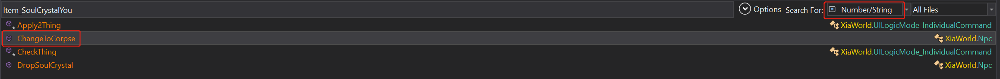

**【原版代码】**
```csharp
if (World.RandomRate(a))
{
	this.SetSpecialFlag(g_emNpcSpecailFlag.FLAG_DROPSOULCRYSTAL, 1);
	ItemThing itemThing = ItemRandomMachine.RandomItem("Item_SoulCrystalYou", null, 0, 12, -1f, 1);
	if (itemThing != null)
	{
		itemThing.Author = this.GetName();
		base.map.DropItem(itemThing, base.Key, true, true, true, true, 0f);
	}
}
```

**【修改内容】**
```csharp
if (World.RandomRate(a))
{
	this.SetSpecialFlag(g_emNpcSpecailFlag.FLAG_DROPSOULCRYSTAL, 1);
	ItemThing itemThing = ItemRandomMachine.RandomItem("Item_SoulCrystalYou", null, 0, 12, -1f, 1);
	if (itemThing != null)
	{
		itemThing.Author = this.GetName();
		base.map.DropItem(itemThing, base.Key, true, true, true, true, 0f);
	}
}
//---------------------------------------- 以下是新增的内容 ----------------------------------------
if (World.RandomRate(a * 0.5f))//加了一点随机因素，概率为幽魄的50%
{
	ItemThing itemThing2 = ItemRandomMachine.RandomItem("Item_SoulCrystalLing", null, 0, 12, -1f, 1);
	if (itemThing2 != null)
	{
		itemThing2.Author = this.GetName();
		base.map.DropItem(itemThing2, base.Key, true, true, true, true, 0f);
	}
}
if (World.RandomRate(a * 0.25f))//加了一点随机因素，概率为幽魄的25%
{
	ItemThing itemThing3 = ItemRandomMachine.RandomItem("Item_SoulCrystalNing", null, 0, 12, -1f, 1);
	if (itemThing3 != null)
	{
		itemThing3.Author = this.GetName();
		base.map.DropItem(itemThing3, base.Key, true, true, true, true, 0f);
	}
}
//---------------------------------------- 以上是新增的内容 ----------------------------------------
```

## 历练相关的修改

### 瞬间历练 + 瞬间驻扎

**【搜索内容】**
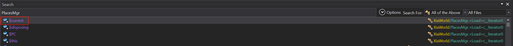

**【原版代码】**
```csharp
```

**【修改内容】**
```csharp
public void AddNpcMapExplore(Npc npc, string place, bool isstay = false)
{
	PlacesMgr.MapExploreData mapExploreData = new PlacesMgr.MapExploreData
	{
		NpcID = npc.ID,
		Place = place
	};
	mapExploreData.Story = World.RandomRange(1f, 8f) * 600f;
	mapExploreData.NeedTime = 0f;//把所需时间改成0
	mapExploreData.IsStay = isstay;
	this.MapExplors.Add(mapExploreData);
	float lingCost = this.GetLingCost(place);
	npc.AddLing(-lingCost);
	GameWatch.Instance.Achievement.AddCount(g_emAchievementCountKind.Explore_Count, 1f);
	SchoolMgr.Instance.AddSchoolData(g_emSchoolData.Explore, 1);
	GameWatch.Instance.BuryingPoint(BuryingPointType.Explore, 1);
}


public override void Step(float dt)
{
	if (WorldMgr.Instance.IsLoading)
	{
		return;
	}
	this.lisremove.Clear();
	foreach (PlacesMgr.MapExploreData mapExploreData in this.MapExplors)
	{
		mapExploreData.StageP += dt;
		Npc npc = ThingMgr.Instance.FindThingByID(mapExploreData.NpcID) as Npc;
		int stage = mapExploreData.Stage;
		if (stage != 0)
		{
			if (stage != 1)
			{
				if (stage == 2)
				{
					if (mapExploreData.IsStay)
					{
						npc.RemoveSpecialFlag(g_emNpcSpecailFlag.FLAG_EXPLORESTAY);
					}
					ToilBase toilBase = (npc.JobEngine.CurJob == null) ? null : npc.JobEngine.CurJob.GetCurToil();
					if (toilBase != null)
					{
						toilBase.SetProgress((mapExploreData.StageP + mapExploreData.NeedTime + 0.01f) / (mapExploreData.NeedTime * 2f + 0.01f));//把原本120f的保底时间改成0.01f。防止分母为0的情况。
					}
					this.ChekStoryOnTheWay(mapExploreData, dt);
					if (mapExploreData.StageP >= mapExploreData.NeedTime)
					{
						this.LeaveNpcMapExplore(mapExploreData);
						this.lisremove.Add(mapExploreData);
					}
				}
			}
			else
			{
				ToilBase toilBase2 = (npc.JobEngine.CurJob == null) ? null : npc.JobEngine.CurJob.GetCurToil();
				if (mapExploreData.IsStay)
				{
					if (!npc.HasSpecialFlag(g_emNpcSpecailFlag.FLAG_EXPLORESTAY))
					{
						npc.AddSpecialFlag(g_emNpcSpecailFlag.FLAG_EXPLORESTAY, 1);
					}
					if (toilBase2 != null)
					{
						toilBase2.SetProgress(0f);
					}
					mapExploreData.Story = 0f;//这里改为0直接触发下面的事件
					if (mapExploreData.Story <= 0f)
					{
						this.TriggerStory(mapExploreData.Place, mapExploreData.NpcID, false);
						mapExploreData.Story = World.RandomRange(2f, 4f) * 600f;
					}
					if (mapExploreData.StageP >= 0.5f)//这里可根据具体一次历练的时间而调整这个数值。瞬间历练修改后，0.1f约等于3次历练。 这里改成0.5f 约等于15次。
					{
						mapExploreData.StageP = 0f;
						mapExploreData.Stage = 2;
						//这里去掉了两行debuff的代码，从而没有了驻扎的CD
						GameEventMgr.Instance.TriggerEvent(10032, npc, null, null, false, 0);
					}
				}
				else
				{
					if (toilBase2 != null)
					{
						toilBase2.SetProgress((mapExploreData.StageP + mapExploreData.NeedTime) / (mapExploreData.NeedTime * 2f + 0.01f));//把原本120f的保底时间改成0.01f。防止分母为0的情况。
					}
					if (mapExploreData.StageP >= 0.01f)
					{
						this.TriggerStory(mapExploreData.Place, mapExploreData.NpcID, false);
						mapExploreData.StageP = 0f;
						mapExploreData.Stage = 2;
					}
				}
			}
		}
		else
		{
			this.ChekStoryOnTheWay(mapExploreData, dt);
			ToilBase toilBase3 = (npc.JobEngine.CurJob == null) ? null : npc.JobEngine.CurJob.GetCurToil();
			if (toilBase3 != null)
			{
				toilBase3.SetProgress(mapExploreData.StageP / (mapExploreData.NeedTime * 2f + 0.01f));//把原本120f的保底时间改成0.01f。防止分母为0的情况。
			}
			if (mapExploreData.StageP >= mapExploreData.NeedTime)
			{
				mapExploreData.Stage = 1;
				mapExploreData.StageP = 0f;
				PlacesMgr.PlaceData placeData = this.GetPlaceData(mapExploreData.Place);
				PlaceDef placeDef = this.GetPlaceDef(mapExploreData.Place);
				if (placeDef.ExploreNum > 0)
				{
					placeData.ArrivedCount += (int)(1f + npc.GetProperty("ExperienceFindSpeedAddV"));
				}
				this.TryUnlock(placeData, placeDef, mapExploreData.NpcID);
				if (placeData.ArrivedCount == 0)
				{
					placeData.ArrivedCount = 1;
					if (placeDef.Links != null && placeDef.Links.Count > 0)
					{
						bool flag = false;
						foreach (string name in placeDef.Links)
						{
							if (this.IsLocked(name))
							{
								flag = true;
								break;
							}
						}
						if (flag)
						{
							Npc npc2 = ThingMgr.Instance.FindThingByID(mapExploreData.NpcID) as Npc;
							MapStoryMgr.Instance.TriggerStorySelection("sys_openplacelink", npc2, mapExploreData.Place, null, null);
						}
					}
				}
				if (mapExploreData.IsStay)
				{
					mapExploreData.Story = 120f;
				}
			}
		}
		if (npc.Rank == g_emNpcRank.Disciple && npc.PropertyMgr.Practice.StoryBroken > 0f)
		{
			npc.PropertyMgr.Practice.StoryBroken = 0f;//这里改成0直接触发下面的事件，瞬间突破瓶颈。
			if (npc.PropertyMgr.Practice.StoryBroken <= 0f)
			{
				MapStoryMgr.Instance.TriggerStorySelection(npc.PropertyMgr.Practice.CurNeck.Story, npc, null, null, null);
			}
		}
	}
	foreach (PlacesMgr.MapExploreData item in this.lisremove)
	{
		this.MapExplors.Remove(item);
	}
}
```

### 真仙可历练

**【搜索内容】**
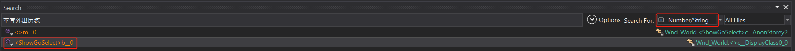


**【原版代码】**
```csharp
if (npc.PropertyMgr.Practice.TouchNeck && npc.PropertyMgr.Practice.CurNeck != null && npc.PropertyMgr.Practice.CurNeck.NeckCountdown > 0f && !npc.HasSpecialFlag(g_emNpcSpecailFlag.FLAG_PRACTICEDIE))//原版代码的判断条件
{
	//省略了N多代码...
}
```

**【修改内容】**
```csharp
if (!this.UIInfo.m_goexp.grayed)
{
	this.UIInfo.m_goexp.onClick.Add(delegate()
	{
		Wnd_SelectNpc.Instance.Select(delegate(List<int> ids)
		{
			if (ids != null && ids.Count > 0)
			{
				foreach (int id in ids)
				{
					Npc npc = ThingMgr.Instance.FindThingByID(id) as Npc;
					if (npc.PropertyMgr.Practice.TouchNeck && npc.PropertyMgr.Practice.CurNeck != null && npc.PropertyMgr.Practice.CurNeck.NeckCountdown > 0f && !npc.HasSpecialFlag(g_emNpcSpecailFlag.FLAG_PRACTICEDIE) && npc.PropertyMgr.Practice.CurNeck.Kind != g_emGongBottleNeckType.Thunder && npc.PropertyMgr.Practice.CurNeck.Kind != g_emGongBottleNeckType.God)//这里的条件判断阻止真仙出门历练，所以加上条件使得真仙不满足条件就不会被阻止出门。
					{
						Wnd_Message.Show(string.Format("{0}的的瓶颈即将松动，暂时不宜外出历练。", npc.GetName()), 1, null, true, "历练", 0, 0, string.Empty);
					}
					//省略N多代码...
				}
			}
		}, g_emNpcRank.Disciple, 1, 10, null, (Npc npc) => npc.CheckCommandSingle("GoMapExplore") == null, string.Format("前往{0}", def.DisplayName), delegate(Npc npc)
		{
			float num = (PlacesMgr.Instance.GetCoat(npc, name) * 2f + 120f) / 600f;
			string text = string.Format("耗时：{0:N2}天\n", num);
			if (num > 3f)
			{
				text += "[color=#B65704]耗时较长[/color]\n";
			}
			return text;
		}, null, false);
	});
}
```

## 炼宝相关的修改

### 成功率100%

**【搜索内容】**
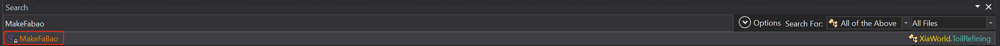

**【原版代码】**
```csharp
```

**【修改内容】**
```csharp
private void MakeFaBao()
{
	g_emItemLable kind = (base.Job.CMD as CommandRefiningFabao).kind;
	ItemThing itemThing = ThingMgr.Instance.FindThingByID(this.itemID) as ItemThing;
	//移除了原本成功概率计算的逻辑
	if (World.RandomRate(1f))//把这里改成1f就达到了100%成功的效果
	{
		BuildingThing inBuilding = base.npc.InBuilding;
		float num = base.npc.PropertyMgr.Luck * 1f + (float)GameDefine.FengShuiRefining[(int)inBuilding.FengShui];
		float num2 = 1f + World.RandomRange(num * -5f, num * 10f) / 100f;
		float lingfix = base.npc.GetProperty("FabaoMake_LingInheritRateAddV") * GameDefine.MindState2RefiningRate[base.npc.Needs.GetNeedLevel(g_emNeedType.MindState)] * num2;
		float qualityadd = base.npc.GetProperty("FabaoMake_QualityAddV") + base.npc.GetProperty("MadeQualityAddValue") + base.npc.GetProperty("ManufactureExpectQuality") * World.RandomRange(base.npc.GetProperty("ManufactureRealQualityPercentMin"), base.npc.GetProperty("ManufactureRealQualityPercentMax"));
		float godrate = base.npc.GetProperty("FabaoMake_TwelveRateChance") * base.npc.Needs.GetNeedValue(g_emNeedType.MindState) / 50f;
		ItemThing itemThing2 = ThingMgr.Instance.AddFaBao(itemThing, kind, lingfix, qualityadd, godrate);
		itemThing2.SetName(ThingMgr.Instance.RandomFabaoName(itemThing, new g_emPrestigeRank?(SchoolMgr.Instance.PrestigeRank)));
		itemThing2.NeedClick = true;
		itemThing2.Author = base.npc.GetName();
		base.npc.map.DropItem(itemThing2, base.npc.Key, true, true, false, false, 0f);
		if (MessageMgr.UseOldMessage)
		{
			MsgMgr.Instance.AddMsg(3, itemThing2, base.npc.GetName(), 0, true, false);
		}
		else
		{
			MessageMgr.Instance.AddMessage(38, new List<Thing>
			{
				itemThing2
			}, base.npc.GetName(), 0, 0, 0);
		}
		SchoolMgr.Instance.AddSchoolData(g_emSchoolData.Fabao, 1);
		if (itemThing2.Rate >= 12)
		{
			GameWatch.Instance.Achievement.UnLockAchievement(2001);
		}
		if (itemThing2.GetQuality() == 1f)
		{
			GameWatch.Instance.Achievement.UnLockAchievement(2000);
		}
		base.npc.PropertyMgr.Practice.AddTreeExp((float)(itemThing2.Rate * itemThing2.Rate) * 10f, false);
		if (base.npc.InBuilding.View != null)
		{
			base.npc.InBuilding.View.OnWorkFinished(true);
		}
		GameWatch.Instance.BuryingPoint(BuryingPointType.Refining, new Dictionary<string, object>
		{
			{
				"Stuff",
				itemThing.GetName()
			},
			{
				"Rate",
				itemThing2.Rate
			}
		});
		NpcMgr.Instance.TriggerNpcStory("RefiningSucceed", base.npc, null, itemThing2.GetName(), false, false);
	}
	else
	{
		base.npc.PropertyMgr.Practice.AddTreeExp(30f, false);
		NpcMgr.Instance.TriggerNpcStory("RefiningFailed", base.npc, null, itemThing.GetName(), false, false);
		if (MessageMgr.UseOldMessage)
		{
			MsgMgr.Instance.AddMsg(2, base.npc, null, 0, true, false);
		}
		else
		{
			MessageMgr.Instance.AddMessage(38, new List<Thing>
			{
				base.npc
			}, null, 1, 0, 0);
		}
		if (base.npc.InBuilding.View != null)
		{
			base.npc.InBuilding.View.OnWorkFinished(false);
		}
		GameWatch.Instance.BuryingPoint(BuryingPointType.Refining, 0);
	}
	GameWatch.Instance.Achievement.AddCount(g_emAchievementCountKind.Refining_Count, 1f);
	itemThing.SubCount(1);
}
```

### 神器概率100%

**【搜索内容】**
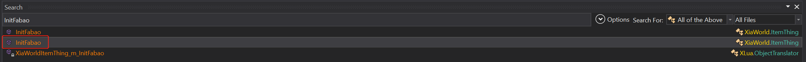

**【原版代码】**
```csharp
```

**【修改内容】**
```csharp
public void InitFabao(ItemThing oitem, g_emItemLable kind, float lingfix = 1f, float Qualityadd = 0f, float godrate = 1f)
{
	float x = oitem.LingV * lingfix;
	int num = oitem.Rate + (int)GameDefine.GetValueByMap<float>(GameDefine.Ling2FabaoRate, x);
	if (num < 12 || !World.RandomRate(godrate))//这一段没改，但是编译器自动修改了代码。
	{//这一段没改，但是编译器自动修改了代码。
	}//这一段没改，但是编译器自动修改了代码。
	num = 12;//直接强制品阶为12，达到100%获得神器的效果。
	this.InitFabao(num, oitem.def, (oitem.StuffDef == null) ? null : oitem.StuffDef.Name, oitem.GetName(), kind, Qualityadd, oitem.GetEquptMod(), oitem.ElementKind);
	this.Fabao.OName = oitem.GetName();
}
```

## 传功相关的修改

### 无视关系传功

**【原版代码】**
```csharp
```

**【修改内容】**
```csharp
case g_emIndividualCommandType.Teach:
{
	Npc npc4 = t as Npc;
	if (!npc4.IsValid || npc4.Rank != g_emNpcRank.Disciple || !npc4.IsPlayerThing)
	{
		this.SetHeadMsg(TFMgr.Get("不是内门弟子"), true);
		return false;
	}
	//这里删除了辈分和境界的两个条件判断，达到可以无视关系任意传功的效果。
	if (npc4.HasSpecialFlag(g_emNpcSpecailFlag.FLAG_MAGIC) || npc4.Lock.FreeCount <= 0)
	{
		this.SetHeadMsg(TFMgr.Get("该角色正忙"), true);
		return false;
	}
	this.SetHeadMsg(null, true);
	return true;
}
```

### 传功所需参悟减少

**【原版代码】**
```csharp
protected override void OnLeaveJob(KStateQUnit unit)
{
	if (base.Did)
	{
		CommandTeachHim commandTeachHim = this.CMD as CommandTeachHim;
		Npc npc = ThingMgr.Instance.FindThingByID(commandTeachHim.NpcID) as Npc;
		EsotericaData sysEsoterica = EsotericaMgr.Instance.GetSysEsoterica(commandTeachHim.EId);
		float num = 0.75f;//非师徒传功参悟比例75%
		if (npc.PropertyMgr.Practice.MasterID == base.Worker.ID)
		{
			num = 0.5f;//师徒传功参悟比例50%
		}
		float num2 = npc.PropertyMgr.Practice.GetTreeExpNeed(sysEsoterica.GetRealDifficulty(npc.PropertyMgr.Practice.Gong.ElementKind)) * num;
		if (num2 <= npc.PropertyMgr.Practice.TreeExp)
		{
			npc.PropertyMgr.Practice.LearnEsotericaEx(commandTeachHim.EId, num, true, false);
		}
		GameWatch.Instance.Achievement.UnLockAchievement(2012);
		this.CMD.FinishCommand(false, false);
	}
}
```

**【修改内容】**

想改成多少都行，随你喜好。 游戏原版比例还算合理所以MOD没有改这个数值。

```csharp
protected override void OnLeaveJob(KStateQUnit unit)
{
	if (base.Did)
	{
		CommandTeachHim commandTeachHim = this.CMD as CommandTeachHim;
		Npc npc = ThingMgr.Instance.FindThingByID(commandTeachHim.NpcID) as Npc;
		EsotericaData sysEsoterica = EsotericaMgr.Instance.GetSysEsoterica(commandTeachHim.EId);
		float num = 0.25f;//非师徒传功参悟比例25%
		if (npc.PropertyMgr.Practice.MasterID == base.Worker.ID)
		{
			num = 0.1f;//师徒传功参悟比例10%
		}
		float num2 = npc.PropertyMgr.Practice.GetTreeExpNeed(sysEsoterica.GetRealDifficulty(npc.PropertyMgr.Practice.Gong.ElementKind)) * num;
		if (num2 <= npc.PropertyMgr.Practice.TreeExp)
		{
			npc.PropertyMgr.Practice.LearnEsotericaEx(commandTeachHim.EId, num, true, false);
		}
		GameWatch.Instance.Achievement.UnLockAchievement(2012);
		this.CMD.FinishCommand(false, false);
	}
}
```

### 传功时间减少

**【原版代码】**
```csharp
protected override List<ToilBase> GetToilList()
{
	CommandTeachHim commandTeachHim = this.CMD as CommandTeachHim;
	Npc npc = ThingMgr.Instance.FindThingByID(commandTeachHim.NpcID) as Npc;
	return new List<ToilBase>
	{
		new ToilFaceIdle(npc.ID, base.Worker.ID, 9999f, TFMgr.Get("接受传授"), false, "dazuo", null),
		ToilGoto.GotoThing(npc, g_emPathEndMode.Touch, 0, true, null).SetMinDis(1f),
		new ToilIdle(20f, false, TFMgr.Get("传授"), "chuangong1", false, 0f).SetFlag("teach")
	};
}
```

**【修改内容】**
```csharp
protected override List<ToilBase> GetToilList()
{
	CommandTeachHim commandTeachHim = this.CMD as CommandTeachHim;
	Npc npc = ThingMgr.Instance.FindThingByID(commandTeachHim.NpcID) as Npc;
	return new List<ToilBase>
	{
		new ToilFaceIdle(npc.ID, base.Worker.ID, 9999f, TFMgr.Get("接受传授"), false, "dazuo", null),
		ToilGoto.GotoThing(npc, g_emPathEndMode.Touch, 0, true, null).SetMinDis(1f),
		new ToilIdle(0.01f, false, TFMgr.Get("传授"), "chuangong1", false, 0f).SetFlag("teach")
	};//把上面一行的20f改成0.01f，达到1s传功的效果
}
```

## 门派人数上限的修改

**【搜索内容】**
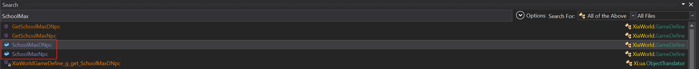

**【原版代码】**
```csharp
public static int[] SchoolMaxNpc = new int[]
{
	12,
	12,
	24,
	36
};
//内门
public static int[] SchoolMaxDNpc = new int[]
{
	12,
	12,
	24,
	36
};
```

**【修改内容】**
```csharp
//外门
public static int[] SchoolMaxNpc = new int[]
{
	24,
	24,
	36,
	48
};
//内门
public static int[] SchoolMaxDNpc = new int[]
{
	24,
	24,
	36,
	48
};
```

## 傀儡相关的修改

**【搜索内容】**
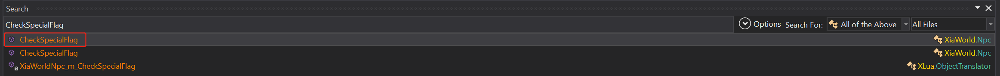

### 去除一人一傀儡的限制

**【原版代码】**
```csharp
public int CheckSpecialFlag(int name)
{
	int result = 0;
	this.SpecialFlag.TryGetValue(name, out result);
	return result;
}
```

**【修改内容】**
```csharp
public int CheckSpecialFlag(int name)
{
	int result = 0;
	this.SpecialFlag.TryGetValue(name, out result);
	//过滤绑定傀儡的两个标记达到允许一人多傀儡的效果。
	if ((g_emNpcSpecailFlag)name == g_emNpcSpecailFlag.NpcBindPuppet || (g_emNpcSpecailFlag)name == g_emNpcSpecailFlag.PuppetBindNpc)//编译器会把枚举类型转换成数值。 编译后会变成 if (name == 10013 || name == 10014)，这是对的。
		result = 0;
	return result;
}
```
## 自动搜索剥皮搬运的修改

**【搜索内容】**
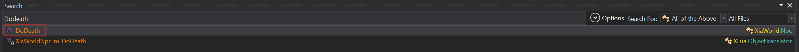

**【原版内容】**
```csharp
```

**【修改内容】**
```csharp
public void DoDeath(bool god = false)
{
	//省略N多代码
	this.LeaveFlying();
	//---------------------------------------以下为新增的代码---------------------------------------
	if (this.JobEngine.CurJob != null)
	{
		this.JobEngine.InterruptJob("DoDeath", false);
	}
	if (!base.IsPlayerThing && this.Race.RaceType != g_emNpcRaceType.Wisdom && this.IsDeath)//如果不是智慧生物并且已死
	{
		base.AddCommand("Slaughter", new object[0]);//添加剥皮指令
	}
	if (this.Race.RaceType == g_emNpcRaceType.Wisdom)//如果是智慧生物，表示是人。
	{
		base.AddCommand("Seach", new object[0]);//添加搜索
		BuildingThing buildingThing = base.map.Things.FindBuilding(this, 9999, null, 0, false, true, 0, 9999, null, "DiePlace", true);//全图查找建筑目标DiePlace,这个是自己做的Mod，新建了一个集结点。
		if (buildingThing != null)//如果找到目标地点，添加搬运的指令，达到自动搬运尸体的效果。
		{
			base.AddCommand("MoveNpc", new object[]
			{
				buildingThing.Key
			});
		}
	}
	//---------------------------------------以上为新增的代码---------------------------------------
	//省略N多代码...
}
```
## 符咒全开

**【修改的类】** NpcEquipData

**【搜索内容】**
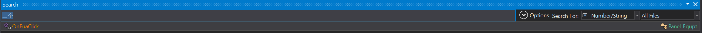


```CSharp
private void OnFuaClick(EventContext context)
{
	//省略N多代码...
	if (!this.npc.Equip.CheackFuThingActive((int)g_emEquipType))
	{
		if (!this.npc.Equip.ActiveItemThing(equipReal, g_emEquipType, false))
		{
			Wnd_Message.Show(TFMgr.Get("同时激活的符咒最多只能有三个！"), 1, null, false, null, 0, 0, string.Empty);
		}
	}
	else
	{
		this.npc.Equip.CloseItemthing(equipReal, g_emEquipType);
	}
	((UI_Checkbox)context.sender).selected = this.npc.Equip.CheackFuThingActive((int)g_emEquipType);
}
```
<kbd>ctrl</kbd> + <kbd>点击</kbd> 上文中的 *ActiveItemThing* 跳转到 NpcEquipData 类。

**【原版内容】**
```csharp
public bool ActiveItemThing(ItemThing item, g_emEquipType type, bool normal = false)
{
	if (type > g_emEquipType._FuBegin && type < g_emEquipType._FuEnd)
	{
		if (this._FuThingActiveList.Count >= 3)//这个3就是罪魁祸首
		{
			return false;
		}
		this._FuThingActiveList.Add((int)type);
	}
	//省略N多代码...
}
```

**【修改内容】**
```csharp
public bool ActiveItemThing(ItemThing item, g_emEquipType type, bool normal = false)
{
	if (type > g_emEquipType._FuBegin && type < g_emEquipType._FuEnd)
	{
		if (this._FuThingActiveList.Count >= 6)//改成6就全开了。或者删除这个if判断也可以。
		{
			return false;
		}
		this._FuThingActiveList.Add((int)type);
	}
	//省略N多代码...
}
```


## 赞助

维护更新不易，如果觉得MOD用着还行，或者教学内容有帮助的话，扫描下方二维码给楼主买根辣条吧，谢谢。


