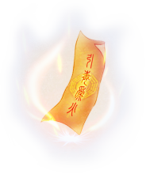

# XiaWorld
了不起的修仙模拟器MOD教程

## 在开始之前

明白修仙模拟器源代码的树形结构能更快的找到所需要的类。


了解dnspy的搜索功能能更快的精准定位，找到所需要的代码。


## 快速画符相关的修改

### 快速画符品质100%

**【修改的类】** Wnd_Painter

**【原版代码】** 
```csharp

````

**【修改内容】** 
```csharp
private void QuickP()
	{
		if (this.UIInfo.m_n62.grayed)
		{
			return;
		}
		if (this.CallBack != null)
		{
			this.CallBack(this.SelectName, 1f, null, false);//直接改成1f,固定100%画符品质
		}
		base.Hide();
	}
````
### 跳过第一次手动画符

**【修改的类】** Wnd_Painter

**【原版代码】** 
````
图片
````

**【修改内容】** 
```csharp
private void OnSelectGong(EventContext context)
	{
		string text = (string)(context.data as GObject).data;
		if (this.SelectName == text)
		{
			return;
		}
		this.SelectName = text;
		if (string.IsNullOrEmpty(text))
		{
			MapRender.Instance.PainRender.sharedMaterial.SetTexture("_Temp", null);
			this.UIInfo.m_n62.grayed = true;
			this.UIInfo.m_n63.text = null;
		}
		else
		{
			SpellDef spellDef = PracticeMgr.Instance.GetSpellDef(text);
			MapRender.Instance.PainRender.sharedMaterial.SetTexture("_Temp", Resources.Load<Texture2D>(spellDef.Template));
			float num = World.Instance.GetFuValue(text);
			num = 1f;//固定获取的画符值为100%，跳过第一次为0的情况。
			if (num > 0f)
			{
				this.UIInfo.m_n62.grayed = false;
				this.UIInfo.m_n63.text = string.Format("{0:P0}", num);
			}
			else
			{
				this.UIInfo.m_n62.grayed = true;
				this.UIInfo.m_n63.text = null;
			}
		}
		MapRender.Instance.PaintPanel.ResetPaint();
	}
````


## 幽淬相关的修改

**【原版代码】** 
```csharp
public bool SoulCrystalYouPowerUp(float badd = 0f, float irate = 0f, int v = 1)
{
	if (base.Rate >= 12)
	{
		return false;
	}
	if (World.RandomRate(Mathf.Pow(0.9f + badd, (float)(base.Rate + this.YouPower))))//幂函数，0.9为底数，次方数=品阶+幽淬次数
	{
		ItemThing itemThing;
		if (base.Count == 1)
		{
			itemThing = this;
		}
		else
		{
			itemThing = this.Split(1, true);
			base.map.DropItem(itemThing, base.Key, true, true, true, false, 0f);
			(UnityEngine.Object.Instantiate(Resources.Load("Effect/System/FlyLine")) as GameObject).GetComponent<FlyLineRender>().Begin(base.Pos, itemThing.Pos, 0.2f, null);
		}
		itemThing.YouPower += v; //幽淬次数+1
		itemThing.Rate += v;	 //品阶+1
		if (itemThing.View != null && itemThing.Rate >= 3)
		{
			itemThing.View.ShowItemRay(new Color?(GameDefine.GetRateColor(itemThing.Rate)));
			itemThing.NeedClick = true;
		}
		GameWatch.Instance.PlayUIAudio("Sound/ding");
		return true;
	}
	return false;
}
````

**【修改内容】** 
```csharp
public bool SoulCrystalYouPowerUp(float badd = 0f, float irate = 0f, int v = 1)
{
	if (base.Rate >= 12)//当品阶大于等于12
	{
		if (this.IsFaBao)//判断是否为法宝
		{
			this.Fabao.AddGodCount(1);//天劫洗练次数加一
			if (this.View != null && base.Rate >= 3)//如果品阶大于等于3,则添加发光，玩家需要点击取消发光
			{
				this.View.ShowItemRay(new Color?(GameDefine.GetRateColor(base.Rate)));
				this.NeedClick = true;
			}
			GameWatch.Instance.PlayUIAudio("Sound/ding");//播放“叮”的一声
			return true;
		}
		return false;
	}
	else
	{
		if (World.RandomRate(Mathf.Pow(1f + badd, (float)(base.Rate + this.YouPower))))//底数改为1则100%成功
		{
			int num = Mathf.Min(10, base.Count);//判断物品本身数量和10做比较，最多循环10次。
			for (int i = 0; i < num; i++)//根据上一步算出的数量循环
			{
				ItemThing itemThing;
				if (base.Count == 1)
				{
					itemThing = this;
				}
				else
				{
					itemThing = this.Split(1, true);
					base.map.DropItem(itemThing, base.Key, true, true, true, false, 0f);
					(UnityEngine.Object.Instantiate(Resources.Load("Effect/System/FlyLine")) as GameObject).GetComponent<FlyLineRender>().Begin(base.Pos, itemThing.Pos, 0.2f, null);
				}
				itemThing.YouPower = 12 - itemThing.Rate;//计算幽淬多少次才能满12阶，次数会影响丹药效果。
				itemThing.Rate = 12;//品阶改成12阶
				if (itemThing.View != null && itemThing.Rate >= 3)
				{
					itemThing.View.ShowItemRay(new Color?(GameDefine.GetRateColor(itemThing.Rate)));
					itemThing.NeedClick = true;
				}
			}
			GameWatch.Instance.PlayUIAudio("Sound/ding");
			return true;
		}
		return false;
	}
}
````


## 灵淬相关的修改


**【原版代码】**
```csharp
public bool SoulCrystalLingPowerUp(float badd = 0f)
{
	if (base.Accommodate <= 0f)
	{
		return false;
	}
	if (World.RandomRate(Mathf.Pow(0.9f + badd, (float)(base.Rate + this.YouPower))))//底数0.9，越淬概率越低
	{
		ItemThing itemThing;
		if (base.Count == 1)
		{
			itemThing = this;
		}
		else
		{
			itemThing = this.Split(1, true);
			base.map.DropItem(itemThing, base.Key, true, true, true, false, 0f);
			(UnityEngine.Object.Instantiate(Resources.Load("Effect/System/FlyLine")) as GameObject).GetComponent<FlyLineRender>().Begin(base.Pos, itemThing.Pos, 0.2f, null);
		}
		itemThing.LingPower++;//灵淬次数加一
		if (itemThing.IsFaBao)//判断是否为法宝
		{
			float property = itemThing.Fabao.GetProperty(g_emFaBaoP.MaxLing);//获取现有最大灵力
			itemThing.Fabao.SetProperty(g_emFaBaoP.MaxLing, property * 1.1f);//最大灵力*1.1，每次增加最大灵力10%
		}
		else
		{
			itemThing.AccommodateAddv += 5f;
		}
		GameWatch.Instance.PlayUIAudio("Sound/ding");
		return true;
	}
	return false;
}
```

**【修改内容】** 
```csharp
public bool SoulCrystalLingPowerUp(float badd = 0f)
{
	if (base.Accommodate <= 0f && !this.IsFaBao)//加上条件跳过法宝
	{
		return false;
	}
	if (World.RandomRate(Mathf.Pow(1f + badd, (float)(base.Rate + this.YouPower))))//底数改成1，概率100%
	{
		ItemThing itemThing;
		if (base.Count == 1)
		{
			itemThing = this;
		}
		else
		{
			itemThing = this.Split(1, true);
			base.map.DropItem(itemThing, base.Key, true, true, true, false, 0f);
			(UnityEngine.Object.Instantiate(Resources.Load("Effect/System/FlyLine")) as GameObject).GetComponent<FlyLineRender>().Begin(base.Pos, itemThing.Pos, 0.2f, null);
		}
		itemThing.LingPower++;//灵淬次数+1
		if (itemThing.IsFaBao)//判断是否为法宝
		{
			float property = itemThing.Fabao.GetProperty(g_emFaBaoP.MaxLing);//获取灵力最大值
			itemThing.Fabao.SetProperty(g_emFaBaoP.MaxLing, property * 1.1f);//灵力最大值增加10%
			float property2 = itemThing.Fabao.GetProperty(g_emFaBaoP.AttackPower);//获取威力
			itemThing.Fabao.SetProperty(g_emFaBaoP.AttackPower, property2 * 1.1f);//威力增加10%
			float property3 = itemThing.Fabao.GetProperty(g_emFaBaoP.RotSpeed);//获取转速
			itemThing.Fabao.SetProperty(g_emFaBaoP.RotSpeed, property3 * 1.1f);//转速增加10%
			float property4 = itemThing.Fabao.GetProperty(g_emFaBaoP.LingRecover);//获取灵力回复速度
			itemThing.Fabao.SetProperty(g_emFaBaoP.LingRecover, property4 * 1.1f);//灵力回复增加10%
			float property5 = itemThing.Fabao.GetProperty(g_emFaBaoP.Scale);//获取体积
			itemThing.Fabao.SetProperty(g_emFaBaoP.Scale, property5 * 1.1f);//体积增加10%
			float property6 = itemThing.Fabao.GetProperty(g_emFaBaoP.TailLenght);//获取拖尾长度
			itemThing.Fabao.SetProperty(g_emFaBaoP.TailLenght, property6 * 1.1f);//拖尾长度增加10%
			float property7 = itemThing.Fabao.GetProperty(g_emFaBaoP.KnockBackAddition);//获取击退能力
			itemThing.Fabao.SetProperty(g_emFaBaoP.KnockBackAddition, property7 * 1.1f);//击退能力增加10%
			float property8 = itemThing.Fabao.GetProperty(g_emFaBaoP.KnockBackResistance);//获取击退抵抗
			itemThing.Fabao.SetProperty(g_emFaBaoP.KnockBackResistance, property8 * 1.1f);//击退抵抗增加10%
			itemThing.Fabao.SetProperty(g_emFaBaoP.AttackRate, 0.3f);//攻击频率固定0.3/s
		}
		else
		{
			itemThing.AccommodateAddv += 5f;
		}
		GameWatch.Instance.PlayUIAudio("Sound/ding");
		return true;
	}
	return false;
}

```


## 大凶房掉三种魄的修改

**【原版代码】**
```csharp
To be added
```

**【修改内容】**
```csharp
if (World.RandomRate(a))
{
	this.SetSpecialFlag(g_emNpcSpecailFlag.FLAG_DROPSOULCRYSTAL, 1);
	ItemThing itemThing = ItemRandomMachine.RandomItem("Item_SoulCrystalYou", null, 0, 12, -1f, 1);
	if (itemThing != null)
	{
		itemThing.Author = this.GetName();
		base.map.DropItem(itemThing, base.Key, true, true, true, true, 0f);
	}
}
if (World.RandomRate(a * 0.5f))
{
	ItemThing itemThing2 = ItemRandomMachine.RandomItem("Item_SoulCrystalLing", null, 0, 12, -1f, 1);
	if (itemThing2 != null)
	{
		itemThing2.Author = this.GetName();
		base.map.DropItem(itemThing2, base.Key, true, true, true, true, 0f);
	}
}
if (World.RandomRate(a * 0.25f))
{
	ItemThing itemThing3 = ItemRandomMachine.RandomItem("Item_SoulCrystalNing", null, 0, 12, -1f, 1);
	if (itemThing3 != null)
	{
		itemThing3.Author = this.GetName();
		base.map.DropItem(itemThing3, base.Key, true, true, true, true, 0f);
	}
}
```

## 历练相关的修改

### 瞬间历练 + 瞬间驻扎

**【原版代码】**
```csharp
```

**【修改内容】**
```csharp
public void AddNpcMapExplore(Npc npc, string place, bool isstay = false)
{
	PlacesMgr.MapExploreData mapExploreData = new PlacesMgr.MapExploreData
	{
		NpcID = npc.ID,
		Place = place
	};
	mapExploreData.Story = World.RandomRange(1f, 8f) * 600f;
	mapExploreData.NeedTime = 0f;//把所需时间改成0
	mapExploreData.IsStay = isstay;
	this.MapExplors.Add(mapExploreData);
	float lingCost = this.GetLingCost(place);
	npc.AddLing(-lingCost);
	GameWatch.Instance.Achievement.AddCount(g_emAchievementCountKind.Explore_Count, 1f);
	SchoolMgr.Instance.AddSchoolData(g_emSchoolData.Explore, 1);
	GameWatch.Instance.BuryingPoint(BuryingPointType.Explore, 1);
}


public override void Step(float dt)
{
	if (WorldMgr.Instance.IsLoading)
	{
		return;
	}
	this.lisremove.Clear();
	foreach (PlacesMgr.MapExploreData mapExploreData in this.MapExplors)
	{
		mapExploreData.StageP += dt;
		Npc npc = ThingMgr.Instance.FindThingByID(mapExploreData.NpcID) as Npc;
		int stage = mapExploreData.Stage;
		if (stage != 0)
		{
			if (stage != 1)
			{
				if (stage == 2)
				{
					if (mapExploreData.IsStay)
					{
						npc.RemoveSpecialFlag(g_emNpcSpecailFlag.FLAG_EXPLORESTAY);
					}
					ToilBase toilBase = (npc.JobEngine.CurJob == null) ? null : npc.JobEngine.CurJob.GetCurToil();
					if (toilBase != null)
					{
						toilBase.SetProgress((mapExploreData.StageP + mapExploreData.NeedTime + 0.01f) / (mapExploreData.NeedTime * 2f + 0.01f));//把原本120f的保底时间改成0.01f。防止分母为0的情况。
					}
					this.ChekStoryOnTheWay(mapExploreData, dt);
					if (mapExploreData.StageP >= mapExploreData.NeedTime)
					{
						this.LeaveNpcMapExplore(mapExploreData);
						this.lisremove.Add(mapExploreData);
					}
				}
			}
			else
			{
				ToilBase toilBase2 = (npc.JobEngine.CurJob == null) ? null : npc.JobEngine.CurJob.GetCurToil();
				if (mapExploreData.IsStay)
				{
					if (!npc.HasSpecialFlag(g_emNpcSpecailFlag.FLAG_EXPLORESTAY))
					{
						npc.AddSpecialFlag(g_emNpcSpecailFlag.FLAG_EXPLORESTAY, 1);
					}
					if (toilBase2 != null)
					{
						toilBase2.SetProgress(0f);
					}
					mapExploreData.Story = 0f;//这里改为0直接触发下面的事件
					if (mapExploreData.Story <= 0f)
					{
						this.TriggerStory(mapExploreData.Place, mapExploreData.NpcID, false);
						mapExploreData.Story = World.RandomRange(2f, 4f) * 600f;
					}
					if (mapExploreData.StageP >= 0.5f)//这里可根据具体一次历练的时间而调整这个数值。瞬间历练修改后，0.1f约等于3次历练。 这里改成0.5f 约等于15次。
					{
						mapExploreData.StageP = 0f;
						mapExploreData.Stage = 2;
						//这里去掉了两行debuff的代码，从而没有了驻扎的CD
						GameEventMgr.Instance.TriggerEvent(10032, npc, null, null, false, 0);
					}
				}
				else
				{
					if (toilBase2 != null)
					{
						toilBase2.SetProgress((mapExploreData.StageP + mapExploreData.NeedTime) / (mapExploreData.NeedTime * 2f + 0.01f));//把原本120f的保底时间改成0.01f。防止分母为0的情况。
					}
					if (mapExploreData.StageP >= 0.01f)
					{
						this.TriggerStory(mapExploreData.Place, mapExploreData.NpcID, false);
						mapExploreData.StageP = 0f;
						mapExploreData.Stage = 2;
					}
				}
			}
		}
		else
		{
			this.ChekStoryOnTheWay(mapExploreData, dt);
			ToilBase toilBase3 = (npc.JobEngine.CurJob == null) ? null : npc.JobEngine.CurJob.GetCurToil();
			if (toilBase3 != null)
			{
				toilBase3.SetProgress(mapExploreData.StageP / (mapExploreData.NeedTime * 2f + 0.01f));//把原本120f的保底时间改成0.01f。防止分母为0的情况。
			}
			if (mapExploreData.StageP >= mapExploreData.NeedTime)
			{
				mapExploreData.Stage = 1;
				mapExploreData.StageP = 0f;
				PlacesMgr.PlaceData placeData = this.GetPlaceData(mapExploreData.Place);
				PlaceDef placeDef = this.GetPlaceDef(mapExploreData.Place);
				if (placeDef.ExploreNum > 0)
				{
					placeData.ArrivedCount += (int)(1f + npc.GetProperty("ExperienceFindSpeedAddV"));
				}
				this.TryUnlock(placeData, placeDef, mapExploreData.NpcID);
				if (placeData.ArrivedCount == 0)
				{
					placeData.ArrivedCount = 1;
					if (placeDef.Links != null && placeDef.Links.Count > 0)
					{
						bool flag = false;
						foreach (string name in placeDef.Links)
						{
							if (this.IsLocked(name))
							{
								flag = true;
								break;
							}
						}
						if (flag)
						{
							Npc npc2 = ThingMgr.Instance.FindThingByID(mapExploreData.NpcID) as Npc;
							MapStoryMgr.Instance.TriggerStorySelection("sys_openplacelink", npc2, mapExploreData.Place, null, null);
						}
					}
				}
				if (mapExploreData.IsStay)
				{
					mapExploreData.Story = 120f;
				}
			}
		}
		if (npc.Rank == g_emNpcRank.Disciple && npc.PropertyMgr.Practice.StoryBroken > 0f)
		{
			npc.PropertyMgr.Practice.StoryBroken = 0f;//这里改成0直接触发下面的事件，瞬间突破瓶颈。
			if (npc.PropertyMgr.Practice.StoryBroken <= 0f)
			{
				MapStoryMgr.Instance.TriggerStorySelection(npc.PropertyMgr.Practice.CurNeck.Story, npc, null, null, null);
			}
		}
	}
	foreach (PlacesMgr.MapExploreData item in this.lisremove)
	{
		this.MapExplors.Remove(item);
	}
}
```

### 真仙可历练

**【原版代码】**
```csharp
```

**【修改内容】**
```csharp
if (!this.UIInfo.m_goexp.grayed)
{
	this.UIInfo.m_goexp.onClick.Add(delegate()
	{
		Wnd_SelectNpc.Instance.Select(delegate(List<int> ids)
		{
			if (ids != null && ids.Count > 0)
			{
				foreach (int id in ids)
				{
					Npc npc = ThingMgr.Instance.FindThingByID(id) as Npc;
					if (npc.PropertyMgr.Practice.TouchNeck && npc.PropertyMgr.Practice.CurNeck != null && npc.PropertyMgr.Practice.CurNeck.NeckCountdown > 0f && !npc.HasSpecialFlag(g_emNpcSpecailFlag.FLAG_PRACTICEDIE) && npc.PropertyMgr.Practice.CurNeck.Kind != g_emGongBottleNeckType.Thunder && npc.PropertyMgr.Practice.CurNeck.Kind != g_emGongBottleNeckType.God)//这里的条件判断阻止真仙出门历练，所以加上条件使得真仙不满足条件就不会被阻止出门。
					{
						Wnd_Message.Show(string.Format("{0}的的瓶颈即将松动，暂时不宜外出历练。", npc.GetName()), 1, null, true, "历练", 0, 0, string.Empty);
					}
					else
					{
						float num = (PlacesMgr.Instance.GetCoat(npc, name) * 2f + 120f) / 600f;
						if (num <= 3f)
						{
							npc.AddCommand("GoMapExplore", new object[]
							{
								name
							});
						}
						else
						{
							Wnd_Message.Show(string.Format("此去路途遥远({2:F2}天)，确定要派遣{0}前往{1}吗？", npc.GetName(), def.DisplayName, num), 2, delegate(string s)
							{
								if (s == "1")
								{
									npc.AddCommand("GoMapExplore", new object[]
									{
										name
									});
								}
							}, true, null, 0, 0, string.Empty);
						}
					}
				}
			}
		}, g_emNpcRank.Disciple, 1, 10, null, (Npc npc) => npc.CheckCommandSingle("GoMapExplore") == null, string.Format("前往{0}", def.DisplayName), delegate(Npc npc)
		{
			float num = (PlacesMgr.Instance.GetCoat(npc, name) * 2f + 120f) / 600f;
			string text = string.Format("耗时：{0:N2}天\n", num);
			if (num > 3f)
			{
				text += "[color=#B65704]耗时较长[/color]\n";
			}
			return text;
		}, null, false);
	});
}
```

## 炼宝相关的修改

### 成功率100%

**【原版代码】**
```csharp
```

**【修改内容】**
```csharp
private void MakeFaBao()
{
	g_emItemLable kind = (base.Job.CMD as CommandRefiningFabao).kind;
	ItemThing itemThing = ThingMgr.Instance.FindThingByID(this.itemID) as ItemThing;
	//移除了原本成功概率计算的逻辑
	if (World.RandomRate(1f))//把这里改成1f就达到了100%成功的效果
	{
		BuildingThing inBuilding = base.npc.InBuilding;
		float num = base.npc.PropertyMgr.Luck * 1f + (float)GameDefine.FengShuiRefining[(int)inBuilding.FengShui];
		float num2 = 1f + World.RandomRange(num * -5f, num * 10f) / 100f;
		float lingfix = base.npc.GetProperty("FabaoMake_LingInheritRateAddV") * GameDefine.MindState2RefiningRate[base.npc.Needs.GetNeedLevel(g_emNeedType.MindState)] * num2;
		float qualityadd = base.npc.GetProperty("FabaoMake_QualityAddV") + base.npc.GetProperty("MadeQualityAddValue") + base.npc.GetProperty("ManufactureExpectQuality") * World.RandomRange(base.npc.GetProperty("ManufactureRealQualityPercentMin"), base.npc.GetProperty("ManufactureRealQualityPercentMax"));
		float godrate = base.npc.GetProperty("FabaoMake_TwelveRateChance") * base.npc.Needs.GetNeedValue(g_emNeedType.MindState) / 50f;
		ItemThing itemThing2 = ThingMgr.Instance.AddFaBao(itemThing, kind, lingfix, qualityadd, godrate);
		itemThing2.SetName(ThingMgr.Instance.RandomFabaoName(itemThing, new g_emPrestigeRank?(SchoolMgr.Instance.PrestigeRank)));
		itemThing2.NeedClick = true;
		itemThing2.Author = base.npc.GetName();
		base.npc.map.DropItem(itemThing2, base.npc.Key, true, true, false, false, 0f);
		if (MessageMgr.UseOldMessage)
		{
			MsgMgr.Instance.AddMsg(3, itemThing2, base.npc.GetName(), 0, true, false);
		}
		else
		{
			MessageMgr.Instance.AddMessage(38, new List<Thing>
			{
				itemThing2
			}, base.npc.GetName(), 0, 0, 0);
		}
		SchoolMgr.Instance.AddSchoolData(g_emSchoolData.Fabao, 1);
		if (itemThing2.Rate >= 12)
		{
			GameWatch.Instance.Achievement.UnLockAchievement(2001);
		}
		if (itemThing2.GetQuality() == 1f)
		{
			GameWatch.Instance.Achievement.UnLockAchievement(2000);
		}
		base.npc.PropertyMgr.Practice.AddTreeExp((float)(itemThing2.Rate * itemThing2.Rate) * 10f, false);
		if (base.npc.InBuilding.View != null)
		{
			base.npc.InBuilding.View.OnWorkFinished(true);
		}
		GameWatch.Instance.BuryingPoint(BuryingPointType.Refining, new Dictionary<string, object>
		{
			{
				"Stuff",
				itemThing.GetName()
			},
			{
				"Rate",
				itemThing2.Rate
			}
		});
		NpcMgr.Instance.TriggerNpcStory("RefiningSucceed", base.npc, null, itemThing2.GetName(), false, false);
	}
	else
	{
		base.npc.PropertyMgr.Practice.AddTreeExp(30f, false);
		NpcMgr.Instance.TriggerNpcStory("RefiningFailed", base.npc, null, itemThing.GetName(), false, false);
		if (MessageMgr.UseOldMessage)
		{
			MsgMgr.Instance.AddMsg(2, base.npc, null, 0, true, false);
		}
		else
		{
			MessageMgr.Instance.AddMessage(38, new List<Thing>
			{
				base.npc
			}, null, 1, 0, 0);
		}
		if (base.npc.InBuilding.View != null)
		{
			base.npc.InBuilding.View.OnWorkFinished(false);
		}
		GameWatch.Instance.BuryingPoint(BuryingPointType.Refining, 0);
	}
	GameWatch.Instance.Achievement.AddCount(g_emAchievementCountKind.Refining_Count, 1f);
	itemThing.SubCount(1);
}
```

### 神器概率100%

**【原版代码】**
```csharp
```

**【修改内容】**
```csharp
public void InitFabao(ItemThing oitem, g_emItemLable kind, float lingfix = 1f, float Qualityadd = 0f, float godrate = 1f)
{
	float x = oitem.LingV * lingfix;
	int num = oitem.Rate + (int)GameDefine.GetValueByMap<float>(GameDefine.Ling2FabaoRate, x);
	if (num < 12 || !World.RandomRate(godrate))//这一段没改，但是编译器自动修改了代码。
	{										   //这一段没改，但是编译器自动修改了代码。
	}										   //这一段没改，但是编译器自动修改了代码。
	num = 12;//直接强制品阶为12，达到100%获得神器的效果。
	this.InitFabao(num, oitem.def, (oitem.StuffDef == null) ? null : oitem.StuffDef.Name, oitem.GetName(), kind, Qualityadd, oitem.GetEquptMod(), oitem.ElementKind);
	this.Fabao.OName = oitem.GetName();
}
```

## 传功相关的修改

### 无视师徒关系传功

**【原版代码】**
```csharp
```

**【修改内容】**
```csharp
```

### 传功所需参悟减少

**【原版代码】**
```csharp
```

**【修改内容】**
```csharp
```

### 传功时间减少

**【原版代码】**
```csharp
```

**【修改内容】**
```csharp
```

## 门派人数上限的修改

**【原版代码】**
```csharp
```

**【修改内容】**
```csharp
//外门
public static int[] SchoolMaxNpc = new int[]
{
	24,
	24,
	36,
	48
};
//内门
public static int[] SchoolMaxDNpc = new int[]
{
	24,
	24,
	36,
	48
};
```

## 傀儡相关的修改

### 去除一人一傀儡的限制

**【原版代码】**
```csharp
```

**【修改内容】**
```csharp
public int CheckSpecialFlag(int name)
{
	int result = 0;
	this.SpecialFlag.TryGetValue(name, out result);
	//过滤绑定傀儡的两个标记达到一人多傀儡的效果。
	if ((g_emNpcSpecailFlag)name == g_emNpcSpecailFlag.NpcBindPuppet || (g_emNpcSpecailFlag)name == g_emNpcSpecailFlag.PuppetBindNpc)
		result = 0;
	return result;
}
```


## 图片资源


S/N	|	Category	|	Image	|	File
----	|	----	|	----	|	----
1	|	Object	|	 	|	object_kuilei1000%20%2844%29.png
2	|	Object	|	 	|	object_kuilei1000%20%2867%29.png
3	|	Object	|	 	|	object_kuilei1000.png
4	|	Object	|	 	|	object_motian1000%20%2848%29.png
5	|	Object	|	 	|	object_motian1000%20%2854%29.png
6	|	Object	|	 	|	object_motian1000%20%2867%29.png
7	|	Object	|	 	|	object_motian1000%20%2868%29.png
8	|	Object	|	 	|	object_qita1000%20%28113%29.png
9	|	Object	|	 	|	object_qita1000%20%2867%29.png
10	|	Object	|	 	|	object_qita1000%20%2874%29.png
11	|	Object	|	 	|	object_qita1000%20%2876%29.png
12	|	Object	|	 	|	object_qita1000%20%2895%29.png
13	|	Object	|	 	|	object_qita1000.png
14	|	Object	|	 	|	object_qqsh1000%20%2831%29.png
15	|	Object	|	 	|	object_qqsh1000%20%2834%29.png
16	|	Object	|	 	|	object_qqsh1000%20%2841%29.png
17	|	Object	|	 	|	object_qqsh1000%20%2848%29.png
18	|	Object	|	 	|	object_shan1000%20%282%29.png
19	|	Object	|	 	|	object_shanzi1000%20%282%29.png
20	|	Object	|	 	|	object_shanzi1000.png
21	|	Object	|	 	|	object_shipin1000%20%283%29.png
22	|	Object	|	 	|	object_shipin1000%20%287%29.png
23	|	Object	|	 	|	object_tdyj1000%20%2821%29.png
24	|	Object	|	 	|	object_tdyj1000%20%2827%29.png
25	|	Object	|	 	|	object_tdyj1000%20%2829%29.png
26	|	Object	|	 	|	object_tdyj1000%20%2830%29.png
27	|	Object	|	 	|	object_wuqi1000%20%281%29.png
28	|	Object	|	 	|	object_wuqi1000%20%2819%29.png
29	|	Object	|	 	|	object_wuqi1000%20%2824%29.png
30	|	Object	|	 	|	object_wuqi1000%20%283%29.png
31	|	Object	|	 	|	object_wuqi1000%20%2838%29.png
32	|	Object	|	 	|	object_wuqi1000%20%2850%29.png
33	|	Object	|	 	|	object_yishou1000%20%2823%29.png
34	|	Object	|	 	|	object_yishou1000%20%2828%29.png
35	|	Object	|	 	|	object_yishou1000%20%283%29.png
36	|	Object	|	 	|	object_yishou1000%20%2833%29.png
37	|	Object	|	 	|	object_yishou1000%20%2846%29.png
38	|	Object	|	 	|	object_yishou1000%20%2848%29.png
39	|	Object	|	 	|	object_yishou1000%20%2859%29.png
40	|	Object	|	 	|	object_yishou1000%20%2870%29.png
41	|	Object	|	 	|	object_yishou1000%20%2872%29.png
42	|	Building	|	 	|	baowuzhi.png
43	|	Building	|	 	|	building_jianlingtai01a.png
44	|	Building	|	 	|	card%20%28320%29.png
45	|	Building	|	 	|	card%20%28322%29.png
46	|	Building	|	 	|	fazuo.png
47	|	Building	|	 	|	huishou.png
48	|	Building	|	 	|	jianzhen1.png
49	|	Building	|	 	|	jianzhen2.png
50	|	Building	|	 	|	jianzhen3.png
51	|	Building	|	 	|	jianzhen4.png
52	|	Building	|	 	|	jianzhen5.png
53	|	Building	|	 	|	jianzhen6.png
54	|	Building	|	 	|	jianzhen7.png
55	|	Building	|	 	|	jianzhen8.png
56	|	Building	|	 	|	jianzhen9.png
57	|	Building	|	 	|	kuangshan.png
58	|	Building	|	 	|	ldk1001.png
59	|	Building	|	 	|	lingbaochui.png
60	|	Building	|	 	|	lingshifang.png
61	|	Building	|	 	|	tianyifang.png
62	|	Building	|	 	|	xiulianzhi.png
63	|	Building	|	 	|	xuanguangjian.png
64	|	Building	|	 	|	yaozushizhe.png
65	|	Fabao	|	 	|	baowu1.png
66	|	Fabao	|	 	|	baowu2.png
67	|	Fabao	|	 	|	baowu3.png
68	|	Fabao	|	 	|	baowu4.png
69	|	Fabao	|	 	|	baowu5.png
70	|	Fabao	|	 	|	baowu6.png
71	|	Fabao	|	 	|	bian1.png
72	|	Fabao	|	 	|	ci1.png
73	|	Fabao	|	 	|	ci2.png
74	|	Fabao	|	 	|	ci3.png
75	|	Fabao	|	 	|	dao1.png
76	|	Fabao	|	 	|	dao2.png
77	|	Fabao	|	 	|	dao4.png
78	|	Fabao	|	 	|	fu1.png
79	|	Fabao	|	 	|	huan1.png
80	|	Fabao	|	 	|	huan2.png
81	|	Fabao	|	 	|	huan3.png
82	|	Fabao	|	 	|	huan4.png
83	|	Fabao	|	 	|	huan5.png
84	|	Fabao	|	 	|	huan6.png
85	|	Fabao	|	 	|	ji1.png
86	|	Fabao	|	 	|	ji2.png
87	|	Fabao	|	 	|	ji3.png
88	|	Fabao	|	 	|	ji4.png
89	|	Fabao	|	 	|	jian1.png
90	|	Fabao	|	 	|	jian10.png
91	|	Fabao	|	 	|	jian11.png
92	|	Fabao	|	 	|	jian12.png
93	|	Fabao	|	 	|	jian13.png
94	|	Fabao	|	 	|	jian14.png
95	|	Fabao	|	 	|	jian2.png
96	|	Fabao	|	 	|	jian3.png
97	|	Fabao	|	 	|	jian4.png
98	|	Fabao	|	 	|	jian5.png
99	|	Fabao	|	 	|	jian6.png
100	|	Fabao	|	 	|	jian7.png
101	|	Fabao	|	 	|	jian8.png
102	|	Fabao	|	 	|	jian9.png
103	|	Fabao	|	 	|	qi1.png
104	|	Fabao	|	 	|	qin1.png
105	|	Fabao	|	 	|	qin2.png
106	|	Fabao	|	 	|	qin3.png
107	|	Fabao	|	 	|	qin4.png
108	|	Fabao	|	 	|	qin5.png
109	|	Fabao	|	 	|	qin6.png
110	|	Fabao	|	 	|	shan1.png
111	|	Fabao	|	 	|	shan10.png
112	|	Fabao	|	 	|	shan11.png
113	|	Fabao	|	 	|	shan2.png
114	|	Fabao	|	 	|	shan3.png
115	|	Fabao	|	 	|	shan4.png
116	|	Fabao	|	 	|	shan5.png
117	|	Fabao	|	 	|	shan6.png
118	|	Fabao	|	 	|	shan7.png
119	|	Fabao	|	 	|	shan8.png
120	|	Fabao	|	 	|	shan9.png
121	|	Fabao	|	 	|	ta1.png
122	|	Fabao	|	 	|	wang1.png
123	|	Fabao	|	 	|	yi1.png
124	|	Fabao	|	 	|	yi2.png
125	|	Fabao	|	 	|	yin1.png
126	|	Fabao	|	 	|	zan1.png
127	|	Fabao	|	 	|	zan2.png
128	|	Fabao	|	 	|	zhu1.png
129	|	Fabao	|	 	|	zhuo1.png
130	|	Lingshi	|	 	|	1lingshi.png
131	|	Lingshi	|	 	|	bailingshi1.png
132	|	Lingshi	|	 	|	bailingshi10.png
133	|	Lingshi	|	 	|	bailingshi11.png
134	|	Lingshi	|	 	|	bailingshi2.png
135	|	Lingshi	|	 	|	bailingshi3.png
136	|	Lingshi	|	 	|	bailingshi4.png
137	|	Lingshi	|	 	|	bailingshi5.png
138	|	Lingshi	|	 	|	bailingshi6.png
139	|	Lingshi	|	 	|	bailingshi7.png
140	|	Lingshi	|	 	|	bailingshi8.png
141	|	Lingshi	|	 	|	bailingshi9.png
142	|	Lingshi	|	 	|	heilingshi1.png
143	|	Lingshi	|	 	|	heilingshi10.png
144	|	Lingshi	|	 	|	heilingshi11.png
145	|	Lingshi	|	 	|	heilingshi2.png
146	|	Lingshi	|	 	|	heilingshi3.png
147	|	Lingshi	|	 	|	heilingshi4.png
148	|	Lingshi	|	 	|	heilingshi5.png
149	|	Lingshi	|	 	|	heilingshi6.png
150	|	Lingshi	|	 	|	heilingshi7.png
151	|	Lingshi	|	 	|	heilingshi8.png
152	|	Lingshi	|	 	|	heilingshi9.png
153	|	Lingshi	|	 	|	huolingshi1.png
154	|	Lingshi	|	 	|	huolingshi10.png
155	|	Lingshi	|	 	|	huolingshi11.png
156	|	Lingshi	|	 	|	huolingshi2.png
157	|	Lingshi	|	 	|	huolingshi3.png
158	|	Lingshi	|	 	|	huolingshi4.png
159	|	Lingshi	|	 	|	huolingshi5.png
160	|	Lingshi	|	 	|	huolingshi6.png
161	|	Lingshi	|	 	|	huolingshi7.png
162	|	Lingshi	|	 	|	huolingshi8.png
163	|	Lingshi	|	 	|	huolingshi9.png
164	|	Lingshi	|	 	|	jinlingshi1.png
165	|	Lingshi	|	 	|	jinlingshi10.png
166	|	Lingshi	|	 	|	jinlingshi11.png
167	|	Lingshi	|	 	|	jinlingshi2.png
168	|	Lingshi	|	 	|	jinlingshi3.png
169	|	Lingshi	|	 	|	jinlingshi4.png
170	|	Lingshi	|	 	|	jinlingshi5.png
171	|	Lingshi	|	 	|	jinlingshi6.png
172	|	Lingshi	|	 	|	jinlingshi7.png
173	|	Lingshi	|	 	|	jinlingshi8.png
174	|	Lingshi	|	 	|	jinlingshi9.png
175	|	Lingshi	|	 	|	mulingshi1.png
176	|	Lingshi	|	 	|	mulingshi10.png
177	|	Lingshi	|	 	|	mulingshi11.png
178	|	Lingshi	|	 	|	mulingshi2.png
179	|	Lingshi	|	 	|	mulingshi3.png
180	|	Lingshi	|	 	|	mulingshi4.png
181	|	Lingshi	|	 	|	mulingshi5.png
182	|	Lingshi	|	 	|	mulingshi6.png
183	|	Lingshi	|	 	|	mulingshi7.png
184	|	Lingshi	|	 	|	mulingshi8.png
185	|	Lingshi	|	 	|	mulingshi9.png
186	|	Lingshi	|	 	|	shuilingshi1.png
187	|	Lingshi	|	 	|	shuilingshi10.png
188	|	Lingshi	|	 	|	shuilingshi11.png
189	|	Lingshi	|	 	|	shuilingshi2.png
190	|	Lingshi	|	 	|	shuilingshi3.png
191	|	Lingshi	|	 	|	shuilingshi4.png
192	|	Lingshi	|	 	|	shuilingshi5.png
193	|	Lingshi	|	 	|	shuilingshi6.png
194	|	Lingshi	|	 	|	shuilingshi7.png
195	|	Lingshi	|	 	|	shuilingshi8.png
196	|	Lingshi	|	 	|	shuilingshi9.png
197	|	Lingshi	|	 	|	tulingshi1.png
198	|	Lingshi	|	 	|	tulingshi10.png
199	|	Lingshi	|	 	|	tulingshi11.png
200	|	Lingshi	|	 	|	tulingshi2.png
201	|	Lingshi	|	 	|	tulingshi3.png
202	|	Lingshi	|	 	|	tulingshi4.png
203	|	Lingshi	|	 	|	tulingshi5.png
204	|	Lingshi	|	 	|	tulingshi6.png
205	|	Lingshi	|	 	|	tulingshi7.png
206	|	Lingshi	|	 	|	tulingshi8.png
207	|	Lingshi	|	 	|	tulingshi9.png
208	|	Lingzhu	|	 	|	1.png
209	|	Lingzhu	|	 	|	2.png
210	|	Lingzhu	|	 	|	3.png
211	|	Lingzhu	|	 	|	4.png
212	|	Lingzhu	|	 	|	5.png
213	|	Lingzhu	|	 	|	lingzhu.png
214	|	Lingzhu	|	 	|	s1.png
215	|	Lingzhu	|	 	|	s2.png
216	|	Lingzhu	|	 	|	s3.png
217	|	Lingzhu	|	 	|	s4.png
218	|	Lingzhu	|	 	|	s5.png
219	|	Lingzhu	|	 	|	z1.png
220	|	Object	|	 	|	1.png
221	|	Object	|	 	|	BIYE.png
222	|	Object	|	 	|	DMXF.png
223	|	Object	|	 	|	FHYJ.png
224	|	Object	|	 	|	HUO.png
225	|	Object	|	 	|	JIN.png
226	|	Object	|	 	|	MU.png
227	|	Object	|	 	|	NEIMEN.png
228	|	Object	|	 	|	QT1.png
229	|	Object	|	 	|	QT10.png
230	|	Object	|	 	|	QT11.png
231	|	Object	|	 	|	QT12.png
232	|	Object	|	 	|	QT13.png
233	|	Object	|	 	|	QT14.png
234	|	Object	|	 	|	QT15.png
235	|	Object	|	 	|	QT2.png
236	|	Object	|	 	|	QT3.png
237	|	Object	|	 	|	QT4.png
238	|	Object	|	 	|	QT5.png
239	|	Object	|	 	|	QT6.png
240	|	Object	|	 	|	QT7.png
241	|	Object	|	 	|	QT8.png
242	|	Object	|	 	|	QT9.png
243	|	Object	|	 	|	SHUI.png
244	|	Object	|	 	|	TGHMS.png
245	|	Object	|	 	|	TGXF.png
246	|	Object	|	 	|	TU.png
247	|	Object	|	 	|	TYSD.png
248	|	Object	|	 	|	TYWJ_1.png
249	|	Object	|	 	|	TYWJ_2.png
250	|	Object	|	 	|	TYWJ_3.png
251	|	Object	|	 	|	TYWJ_4.png
252	|	Object	|	 	|	TYWJ_5.png
253	|	Object	|	 	|	WAIMEN.png
254	|	Object	|	 	|	XXFB.png
255	|	Object	|	 	|	XXHF.png
256	|	Object	|	 	|	XXLL.png
257	|	Object	|	 	|	XXLQ.png
258	|	Object	|	 	|	XXQL.png
259	|	Object	|	 	|	XXSF.png
260	|	Object	|	 	|	XXSZ.png
261	|	Object	|	 	|	XXTN.png
262	|	Object	|	 	|	XXXL.png
263	|	Object	|	 	|	YT1.png
264	|	Object	|	 	|	YT10.png
265	|	Object	|	 	|	YT11.png
266	|	Object	|	 	|	YT12.png
267	|	Object	|	 	|	YT13.png
268	|	Object	|	 	|	YT2.png
269	|	Object	|	 	|	YT3.png
270	|	Object	|	 	|	YT4.png
271	|	Object	|	 	|	YT5.png
272	|	Object	|	 	|	YT6.png
273	|	Object	|	 	|	YT7.png
274	|	Object	|	 	|	YT8.png
275	|	Object	|	 	|	YT9.png
276	|	Object	|	 	|	YTCJG.png
277	|	Object	|	 	|	YTXLT.png
278	|	Object	|	 	|	YTXY.png
279	|	Object	|	 	|	bagua1.png
280	|	Object	|	 	|	bagua2.png
281	|	Object	|	 	|	bagua3.png
282	|	Object	|	 	|	bagua4.png
283	|	Object	|	 	|	bagua5.png
284	|	Object	|	 	|	bagua6.png
285	|	Object	|	 	|	bagua7.png
286	|	Object	|	 	|	bagua8.png
287	|	Object	|	 	|	bang.png
288	|	Object	|	 	|	car.png
289	|	Object	|	 	|	danyao.png
290	|	Object	|	 	|	danyao1.png
291	|	Object	|	 	|	danyao2.png
292	|	Object	|	 	|	danyao3.png
293	|	Object	|	 	|	danyao4.png
294	|	Object	|	 	|	danyao5.png
295	|	Object	|	 	|	danyao6.png
296	|	Object	|	 	|	gang.png
297	|	Object	|	 	|	gang2.png
298	|	Object	|	 	|	huolinggen.png
299	|	Object	|	 	|	jinlinggen.png
300	|	Object	|	 	|	jinqian1.png
301	|	Object	|	 	|	jinxiazi.png
302	|	Object	|	 	|	kuangwuyuanshi1.png
303	|	Object	|	 	|	kuangwuyuanshi2.png
304	|	Object	|	 	|	kuangwuyuanshi3.png
305	|	Object	|	 	|	kuangwuyuanshi4.png
306	|	Object	|	 	|	kuangwuyuanshi5.png
307	|	Object	|	 	|	lanchouduan.png
308	|	Object	|	 	|	lanlingluo.png
309	|	Object	|	 	|	ldk1001.jpg
310	|	Object	|	 	|	lingshidai1.png
311	|	Object	|	 	|	lingshidai2.png
312	|	Object	|	 	|	lingshixiang1.png
313	|	Object	|	 	|	lingshixiang2.png
314	|	Object	|	 	|	macbookair.png
315	|	Object	|	 	|	mulinggen.png
316	|	Object	|	 	|	object_PINGdanyao031.png
317	|	Object	|	 	|	object_PINGdanyao032.png
318	|	Object	|	 	|	object_PINGdanyao033.png
319	|	Object	|	 	|	object_PINGdanyao034.png
320	|	Object	|	 	|	object_PINGdanyao035.png
321	|	Object	|	 	|	object_lingshi01.png
322	|	Object	|	 	|	object_shixiazi01.png
323	|	Object	|	 	|	object_shixiazi02.png
324	|	Object	|	 	|	object_shixiazi03.png
325	|	Object	|	 	|	object_shixiazi04.png
326	|	Object	|	 	|	object_stariron.png
327	|	Object	|	 	|	object_stariron2.png
328	|	Object	|	 	|	object_stariron3.png
329	|	Object	|	 	|	object_stariron4.png
330	|	Object	|	 	|	object_stariron5.png
331	|	Object	|	 	|	object_tianjiezhixi1.png
332	|	Object	|	 	|	object_tianjiezhixi2.png
333	|	Object	|	 	|	object_tianjiezhixi3.png
334	|	Object	|	 	|	object_tianjiezhixi4.png
335	|	Object	|	 	|	object_tianjiezhixi5.png
336	|	Object	|	 	|	object_weapongong01.png
337	|	Object	|	 	|	object_weaponjian01.png
338	|	Object	|	 	|	object_yusui01.png
339	|	Object	|	 	|	object_yusui02.png
340	|	Object	|	 	|	object_yusui03.png
341	|	Object	|	 	|	pojiudemuxia.png
342	|	Object	|	 	|	qianpiao.png
343	|	Object	|	 	|	qingyunshan.png
344	|	Object	|	 	|	qingyunshan0.png
345	|	Object	|	 	|	qingyunshan1.png
346	|	Object	|	 	|	qingyunshan2.png
347	|	Object	|	 	|	qingyunshan3.png
348	|	Object	|	 	|	shuilinggen.png
349	|	Object	|	 	|	smartphone.png
350	|	Object	|	 	|	suipian.png
351	|	Object	|	 	|	taiyiling.png
352	|	Object	|	 	|	tulinggen.png
353	|	Object	|	 	|	xiangzi1.png
354	|	Object	|	 	|	xiangzi2.png
355	|	Object	|	 	|	youmingjian.png
356	|	Object	|	 	|	youmingjian1.png
357	|	Object	|	 	|	youmingjian2.png
358	|	Object	|	 	|	youmingjian3.png
359	|	Object	|	 	|	youmingjian4.png
360	|	Object	|	 	|	youmingjian5.png
361	|	Shoupi	|	 	|	shoupi1.png
362	|	Shoupi	|	 	|	shoupi2.png
363	|	Shoupi	|	 	|	shoupi3.png
364	|	Shoupi	|	 	|	shoupi4.png
365	|	Shoupi	|	 	|	shoupi5.png
366	|	Shoupi	|	 	|	yumao1.png
367	|	Shoupi	|	 	|	yumao2.png
368	|	Shoupi	|	 	|	yumao3.png
369	|	Shoupi	|	 	|	yumao4.png
370	|	Shoupi	|	 	|	yumao5.png
371	|	Tubiao	|	 	|	1.png
372	|	Tubiao	|	 	|	10.png
373	|	Tubiao	|	 	|	11.png
374	|	Tubiao	|	 	|	12.png
375	|	Tubiao	|	 	|	13.png
376	|	Tubiao	|	 	|	2.png
377	|	Tubiao	|	 	|	3.png
378	|	Tubiao	|	 	|	4.png
379	|	Tubiao	|	 	|	5.png
380	|	Tubiao	|	 	|	6.png
381	|	Tubiao	|	 	|	7.png
382	|	Tubiao	|	 	|	8.png
383	|	Tubiao	|	 	|	9.png
384	|	Tubiao	|	 	|	huo1.png
385	|	Tubiao	|	 	|	huo2.png
386	|	Tubiao	|	 	|	huo3.png
387	|	Tubiao	|	 	|	jin1.png
388	|	Tubiao	|	 	|	jin2.png
389	|	Tubiao	|	 	|	jin3.png
390	|	Tubiao	|	 	|	mu1.png
391	|	Tubiao	|	 	|	mu2.png
392	|	Tubiao	|	 	|	mu3.png
393	|	Tubiao	|	 	|	renfu.png
394	|	Tubiao	|	 	|	shui1.png
395	|	Tubiao	|	 	|	shui2.png
396	|	Tubiao	|	 	|	shui3.png
397	|	Tubiao	|	 	|	tianfu.png
398	|	Tubiao	|	 	|	tu1.png
399	|	Tubiao	|	 	|	tu2.png
400	|	Tubiao	|	 	|	tu3.png
401	|	Ui	|	 	|	BQT.png
402	|	Ui	|	 	|	DM_1.png
403	|	Ui	|	 	|	DM_2.png
404	|	Ui	|	 	|	DM_3.png
405	|	Ui	|	 	|	DM_4.png
406	|	Ui	|	 	|	DM_5.png
407	|	Ui	|	 	|	DM_6.png
408	|	Ui	|	 	|	DM_7.png
409	|	Ui	|	 	|	DM_a1.png
410	|	Ui	|	 	|	DM_a2.png
411	|	Ui	|	 	|	DM_a3.png
412	|	Ui	|	 	|	DM_a4.png
413	|	Ui	|	 	|	DM_e1.png
414	|	Ui	|	 	|	DM_k1.png
415	|	Ui	|	 	|	DM_k2.png
416	|	Ui	|	 	|	DM_k3.png
417	|	Ui	|	 	|	DM_k4.png
418	|	Ui	|	 	|	DM_k5.png
419	|	Ui	|	 	|	DM_k6.png
420	|	Ui	|	 	|	DTT.png
421	|	Ui	|	 	|	FHT.png
422	|	Ui	|	 	|	FH_1.png
423	|	Ui	|	 	|	FH_2.png
424	|	Ui	|	 	|	FH_3.png
425	|	Ui	|	 	|	FH_4.png
426	|	Ui	|	 	|	FH_5.png
427	|	Ui	|	 	|	FH_6.png
428	|	Ui	|	 	|	FH_7.png
429	|	Ui	|	 	|	FH_8.png
430	|	Ui	|	 	|	FH_9.png
431	|	Ui	|	 	|	FH_a1.png
432	|	Ui	|	 	|	FH_a2.png
433	|	Ui	|	 	|	FH_b1.png
434	|	Ui	|	 	|	FH_b2.png
435	|	Ui	|	 	|	FH_b3.png
436	|	Ui	|	 	|	FH_b4.png
437	|	Ui	|	 	|	FH_b5.png
438	|	Ui	|	 	|	FH_b6.png
439	|	Ui	|	 	|	FH_c1.png
440	|	Ui	|	 	|	FH_c2.png
441	|	Ui	|	 	|	FH_c3.png
442	|	Ui	|	 	|	FH_c4.png
443	|	Ui	|	 	|	FH_c5.png
444	|	Ui	|	 	|	FH_d1.png
445	|	Ui	|	 	|	FH_d2.png
446	|	Ui	|	 	|	FH_d3.png
447	|	Ui	|	 	|	FH_e1.png
448	|	Ui	|	 	|	FH_e2.png
449	|	Ui	|	 	|	HMT.png
450	|	Ui	|	 	|	SY_1.png
451	|	Ui	|	 	|	SY_2.png
452	|	Ui	|	 	|	SY_3.png
453	|	Ui	|	 	|	SY_4.png
454	|	Ui	|	 	|	SY_5.png
455	|	Ui	|	 	|	SY_6.png
456	|	Ui	|	 	|	SY_7.png
457	|	Ui	|	 	|	SY_e2.png
458	|	Ui	|	 	|	TGT.png
459	|	Ui	|	 	|	TG_1.png
460	|	Ui	|	 	|	TG_10.png
461	|	Ui	|	 	|	TG_11.png
462	|	Ui	|	 	|	TG_12.png
463	|	Ui	|	 	|	TG_13.png
464	|	Ui	|	 	|	TG_14.png
465	|	Ui	|	 	|	TG_2.png
466	|	Ui	|	 	|	TG_3.png
467	|	Ui	|	 	|	TG_4.png
468	|	Ui	|	 	|	TG_5.png
469	|	Ui	|	 	|	TG_6.png
470	|	Ui	|	 	|	TG_7.png
471	|	Ui	|	 	|	TG_8.png
472	|	Ui	|	 	|	TG_9.png
473	|	Ui	|	 	|	TG_a1.png
474	|	Ui	|	 	|	TG_a2.png
475	|	Ui	|	 	|	TG_a3.png
476	|	Ui	|	 	|	TG_a4.png
477	|	Ui	|	 	|	TG_a5.png
478	|	Ui	|	 	|	TG_a6.png
479	|	Ui	|	 	|	TG_b1.png
480	|	Ui	|	 	|	TG_b2.png
481	|	Ui	|	 	|	TG_b3.png
482	|	Ui	|	 	|	TG_b4.png
483	|	Ui	|	 	|	TG_b5.png
484	|	Ui	|	 	|	TG_b6.png
485	|	Ui	|	 	|	TG_b7.png
486	|	Ui	|	 	|	TG_c1.png
487	|	Ui	|	 	|	TG_c10.png
488	|	Ui	|	 	|	TG_c2.png
489	|	Ui	|	 	|	TG_c3.png
490	|	Ui	|	 	|	TG_c4.png
491	|	Ui	|	 	|	TG_c5.png
492	|	Ui	|	 	|	TG_c6.png
493	|	Ui	|	 	|	TG_c7.png
494	|	Ui	|	 	|	TG_c8.png
495	|	Ui	|	 	|	TG_c9.png
496	|	Ui	|	 	|	TG_d1.png
497	|	Ui	|	 	|	TG_d2.png
498	|	Ui	|	 	|	TG_d3.png
499	|	Ui	|	 	|	TG_d4.png
500	|	Ui	|	 	|	TG_d5.png
501	|	Ui	|	 	|	TG_d6.png
502	|	Ui	|	 	|	TG_e1.png
503	|	Ui	|	 	|	TG_e2.png
504	|	Ui	|	 	|	TG_e3.png
505	|	Wuqi	|	 	|	asd.png
506	|	Wuqi	|	 	|	chui1.png
507	|	Wuqi	|	 	|	chui2.png
508	|	Wuqi	|	 	|	dao1.png
509	|	Wuqi	|	 	|	dao2.png
510	|	Wuqi	|	 	|	fuzhou.png
511	|	Wuqi	|	 	|	fuzhou1.png
512	|	Wuqi	|	 	|	fuzhou2.png
513	|	Wuqi	|	 	|	fuzhou3.png
514	|	Wuqi	|	 	|	fuzhou4.png
515	|	Wuqi	|	 	|	gong1.png
516	|	Wuqi	|	 	|	gong2.png
517	|	Wuqi	|	 	|	huan1.png
518	|	Wuqi	|	 	|	huan2.png
519	|	Wuqi	|	 	|	jian.png
520	|	Wuqi	|	 	|	jian1.png
521	|	Wuqi	|	 	|	jian2.png
522	|	Wuqi	|	 	|	jians1.png
523	|	Wuqi	|	 	|	jians2.png
524	|	Wuqi	|	 	|	jians3.png
525	|	Wuqi	|	 	|	jians4.png
526	|	Wuqi	|	 	|	jians5.png
527	|	Wuqi	|	 	|	qiang1.png
528	|	Wuqi	|	 	|	qiang2.png
529	|	Wuqi	|	 	|	shangqingdaopao.png
530	|	Wuqi	|	 	|	shangqingdaopao2.png
531	|	Wuqi	|	 	|	taijidaopao.png
532	|	Wuqi	|	 	|	taijidaopao2.png
533	|	Wuqi	|	 	|	taiqingdaopao.png
534	|	Wuqi	|	 	|	taiqingdaopao2.png
535	|	Wuqi	|	 	|	wuzidaofu.png
536	|	Wuqi	|	 	|	xianshenbaolu.png
537	|	Wuqi	|	 	|	yuqingdaopao.png
538	|	Wuqi	|	 	|	yuqingdaopao2.png
539	|	Wuqi	|	 "	|	224%20%282%29.png
540	|	Ziti	|	 	|	dao.png
541	|	Ziti	|	 	|	jian.png
542	|	Ziti	|	 	|	mo.png
543	|	Ziti	|	 	|	sanjie.png
544	|	Ziti	|	 	|	sha.png
545	|	Ziti	|	 	|	zhan.png


